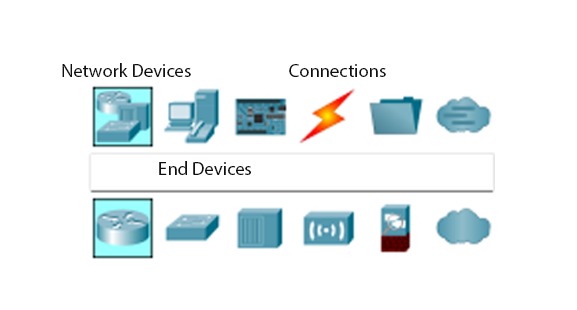
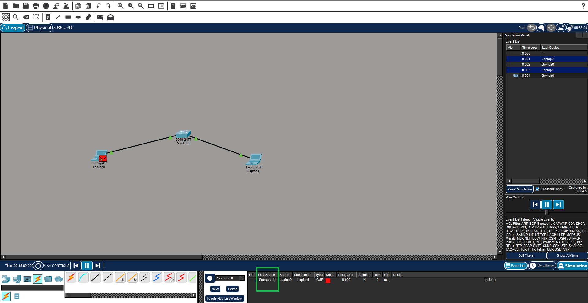
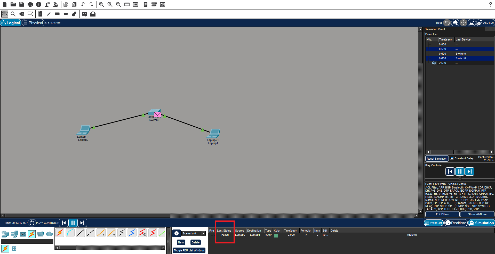
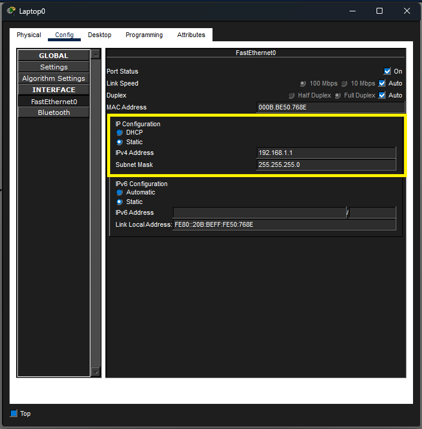
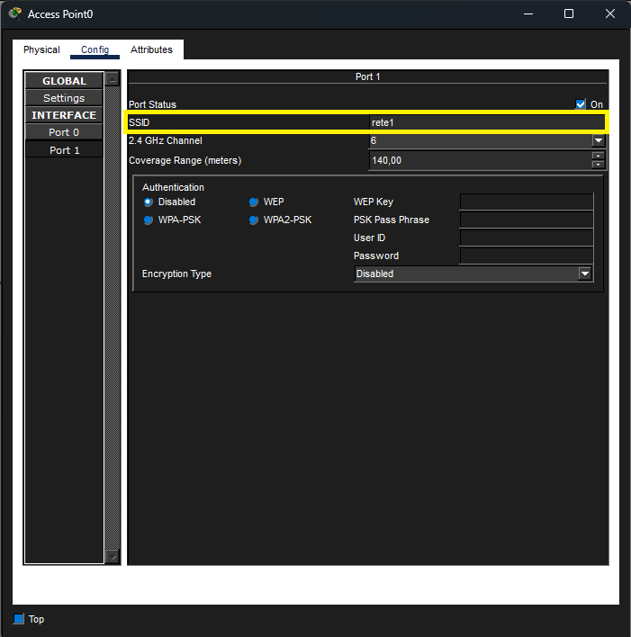
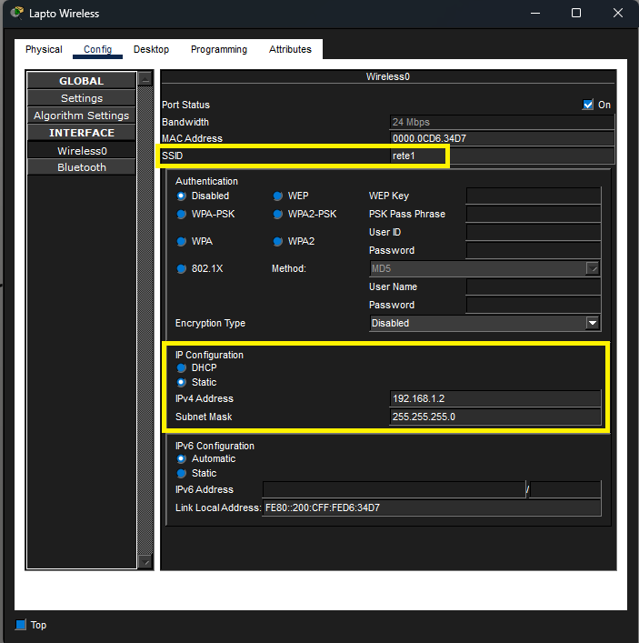
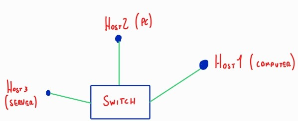

# Manuale CISCO Packet Tracer

## 1 Nozioni di base

### 1.1 Palette dei dispositivi

In basso a sinistra si trova la palette dei dispositivi, suddivisa in sei sezioni in base al tipo di componenti che si desidera inserire nel progetto.

In ordine da sinistra, le sezioni della palette dei dispositivi sono:

1. **Network Devices (Dispositivi di rete)**  
   Contiene tutti i dispositivi fondamentali per creare una rete, come **router, switch, hub e firewall**. Questi apparati permettono di instradare e gestire il traffico dati.

2. **End Devices (Dispositivi finali)**  
   Include i dispositivi degli utenti o terminali della rete, come **PC, laptop, server, telefoni IP e tablet**. Questi dispositivi inviano e ricevono dati attraverso la rete.

3. **Components (Componenti)**  
   Comprende **moduli aggiuntivi** da inserire nei dispositivi di rete, come schede di rete, schede wireless o interfacce supplementari per router e switch.

4. **Connections (Connessioni)**  
   Contiene i **cavi e le connessioni** per collegare i dispositivi, come cavi Ethernet, cavi seriali o connessioni wireless.

5. **Miscellaneous (Varie)**  
   Qui si trovano **strumenti aggiuntivi**, come sensori, luci di segnalazione o altre funzionalità speciali non incluse nelle altre categorie.

6. **Multiuser Connection (Connessione multiutente)**  
   Permette di creare **connessioni tra più utenti o istanze di Packet Tracer**, utile per esercitazioni collaborative o simulazioni avanzate.

# 1.2 Simulazione
Per quanto riguarda la simulazione, è possibile verificare la corretta comunicazione tra due host o dispositivi di rete utilizzando il comando **Add Simple PDU** e cliccando sui due host da testare.

Successivamente, per visualizzare il risultato della comunicazione, bisogna andare su **Simulation**, cliccare su *Play* e controllare nella tabella in basso la colonna **Last Status**.  
- Se compare la scritta **Successful**, significa che i due host comunicano correttamente.
  
- In caso contrario, c'è un problema, che può essere di natura fisica (cavi non collegati correttamente) o legato alla configurazione di rete dei singoli host.

# 1.3 Configurazione di rete di un host
Per configurare un host all'interno di una rete, sia cablata (**wired**) che wireless, è necessario assegnargli un **IP univoco** e una **maschera di rete**.

- **Dispositivi cablati (wired):**  
  1. Cliccare sull'host.  
  2. Andare nella sezione **Config**.  
  3. Selezionare la scheda **FastEthernet**.  
  4. Nella parte relativa all'indirizzo **IPv4**, inserire l'**IP** e la **maschera di rete**.

- **Dispositivi wireless:**  
  1. Cliccare sull'host.  
  2. Andare nella sezione **Config**.  
  3. Selezionare la scheda **Wireless**.  
  4. Inserire l'**IP** e la **maschera di rete**, e impostare l'**SSID** corrispondente all'Access Point a cui ci si vuole collegare.

## 2 Singola rete LAN: 1 switch con più host

### 2.1 Descrizione
In questo esempio si realizza una **rete LAN semplice** composta da un singolo **switch** collegato a più **host** (PC o dispositivi finali).  
Tutti gli host appartengono alla stessa rete e possono comunicare tra loro tramite lo switch.  
Questa configurazione è utile per simulare ambienti di rete domestici o piccoli uffici, dove tutti i dispositivi condividono lo stesso segmento di rete.

### 2.2 Morfologia

### 2.3 Realizzazione fisica della rete
Per iniziare, inserire nel progetto un PC, un computer e un server. Questi dispositivi si trovano nella palette dei dispositivi, nella sezione **End Devices** → **End Devices**.  

Successivamente, aggiungere uno switch dalla sezione **Network Devices** → **Switches**.  

Infine, collegare tutti gli host allo switch utilizzando i cavi. È possibile utilizzare la scelta automatica del cavo per semplificare il collegamento.

### 2.4 Configurazione degli IP e delle maschere

Come si può notare dall'immagine sopra, i collegamenti allo switch sono segnati in arancione. Questo indica che la comunicazione non funzionerebbe correttamente se provassimo a simularla in questo momento, perché non sono stati ancora assegnati IP e maschere agli host.  

Procederemo creando una rete di tipo **C**, con **24 bit per la rete** e **8 bit per gli host**, utilizzando la maschera **255.255.255.0**. L'indirizzo di rete scelto sarà **192.168.1.0**, e agli host assegneremo gli IP seguenti: **192.168.1.1** al PC, **192.168.1.11** al computer e **192.168.1.101** al server.